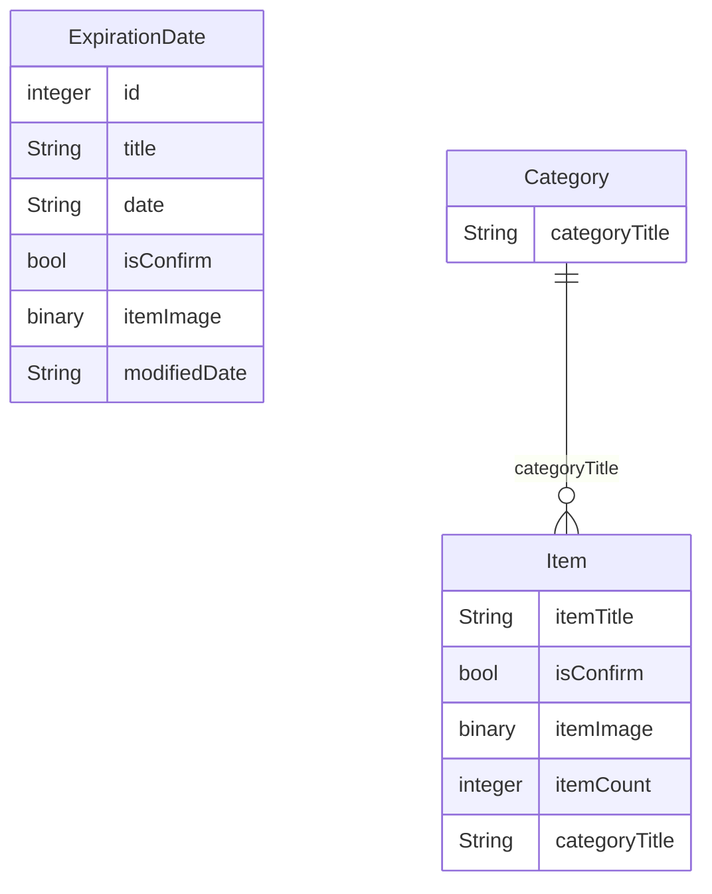

# 편의점 덕후 : 편의점 업무 도우미

# 1. 소개 및 기간

### 1.1 소개

- 매번 종이로 일일이 적기 불편하셨던 분들을 위한 서비스를 만들었습니다.
  이제 편의점 덕후와 함께 효율적으로 일해보세요!

### 1.2 개발 기간

- 2023.12.26 - 2024.1.2 (1주)

## 2. 목표와 기능

### 2.1 목표

- CoreData 를 사용하여 유통기한/재고 물품 내역을 저장하는 것
- 일하는 시간과 시급을 입력하여, 나의 일급/주급/월급을 계산하는 것

### 2.2 기능

- 유통기한 알림 기능
- 유통기한 상품 작성 기능
- 상품 조사 카테고리 / 아이템 작성 기능
- 일급 / 주급 / 월급 계산 기능

## 3. 개발 환경

### 3.1 개발 환경 및 배포 URL

- 버전 정보
  - iOS 16.0 이상
- 라이브러리 및 프레임워크
  - `UIKit`
  - `CoreData`

## 4. UI

### 4.1 페이지별 화면

<table>
    <tbody>
        <tr>
            <td>유통기한 물품 조회 페이지</td>
            <td>유통기한 물품 작성 페이지</td>
        </tr>
        <tr>
            <td>
		
            </td>
            <td>
                
            </td>
        </tr>
        <tr>
            <td>상품 보충 카테고리 페이지</td>
            <td>상품 보충 아이템 페이지</td>
        </tr>
        <tr>
            <td>
                
            </td>
            <td>
                
            </td>
        </tr>
        <tr>
            <td>상품 조회 작성 페이지</td>
            <td>일급/주급/월급 계산 페이지</td>
        </tr>
        <tr>
            <td>
                
            </td>
            <td>
                
            </td>
        </tr>
      <tbody/>
    <table/>

## 5. 데이터베이스 모델링(ERD)

